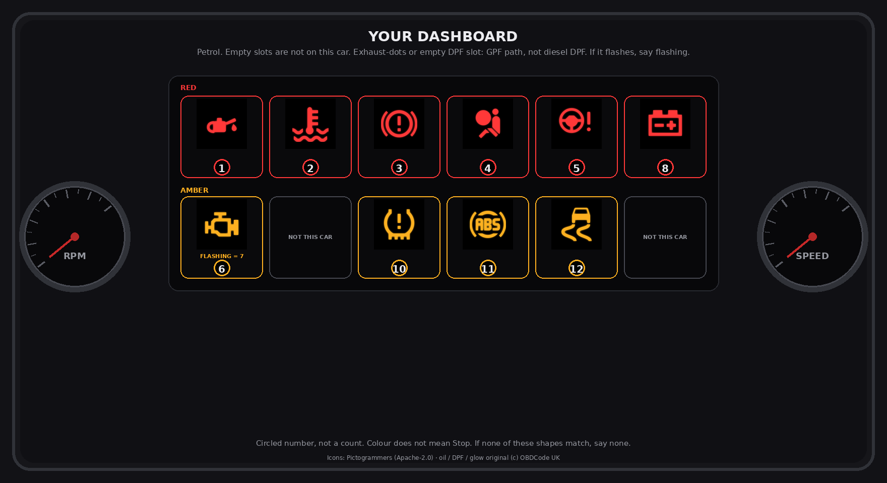

# UK dashboard lamp to garage card

A Cursor skill for UK drivers: **number plate + which warning lamp is lit** → a garage-ready statement, then repair or sell. It is **not** a fault-code dictionary.

Why install: the owner usually has a lamp, not a `P` code. This pack identifies the vehicle, shows a fuel-matched dashboard picture, writes what to tell the garage, and says whether to close it yourself, book a workshop, or put an estimate next to a sell bid. It does not diagnose. It does not invent pounds.



Sample spoken card (oil lamp, fictional plate `AB12CDE` → “your 2016 Fiesta”):

```
[Drive advice] Stop. Do not drive it in. Ask the garage to collect, or call recovery.
[Outlook]      Repair may cost more than the car. We publish no engine-rebuild figure.
```

## What it does not do

- Diagnose a part from a lamp
- Republish SAE J2012 code definitions
- VIN / US plate / NHTSA / Carfax / smog / USD quotes (refuse and stop)
- Driveway work on oil, hot coolant, hydraulic brakes, airbags, or a flashing engine lamp
- Wrap / remap / filter-delete how-to (sale-price band only)
- Invent repair, sell, or “adds £800” figures
- Quote MOT certificate wording (fusion slug + DVSA / Crown line only)

## Install (Python 3.10+)

```bash
git clone https://github.com/hongzhizuo/obdcode-uk-fault-intake.git \
  ~/.cursor/skills/obdcode-uk-fault-intake
cd ~/.cursor/skills/obdcode-uk-fault-intake
python3 --version   # 3.10 or newer (the MCP server uses dict | None)
python3 scripts/show_lamps_mcp.py --self-test
python3 scripts/install_mcp.py
```

`install_mcp.py` merges `mcp.json.example` into `~/.cursor/mcp.json` using this checkout’s absolute path. Reload MCP, then start a **new** Agent chat. Old threads will not pick up the tools.

Cursor 3.11 concatenates `data:image/${mimeType}`. The installer sets `OBDCODE_IMAGE_MIME=png` for that host. Other MCP hosts should omit the env var so the server sends spec `image/png`.

### Claude Desktop / other MCP hosts

Copy the `mcpServers` block from `mcp.json.example`, point `args` at `scripts/show_lamps_mcp.py` in this checkout, and **do not** set `OBDCODE_IMAGE_MIME`. There is no `open_resource` on those hosts; the tool returns the PNG.

Triggers: `@obdcode-uk-dashboard-lamps` (model invocation is off until you delete `disable-model-invocation`). Worked turns are in `references/examples.md`. Do not ask if they are driving.

A passing first lamp run: consent, then matching `cluster-*.png` (empty `board` is a fail). A passing oil run: Stop + recovery in **[Drive advice]**, no parking quiz, no shop link above Stop.

## Layout

| File | Contents |
|---|---|
| `SKILL.md` | One-page workflow, 13 ids, red lines |
| `references/drive-advice.md` | The only Stop list. Colour does not set Stop |
| `references/boards.md` | Fuel → board; unmatched paths |
| `references/lamp-picker.md` | Show the PNG, ask for the circled number |
| `references/vehicle-lookup.md` | Consent, POST `/api/vehicle`, failure modes |
| `references/output.md` | Spoken card, pass/fail, diagnosis refuse |
| `references/prognosis.md` | Repair-or-sell buckets and money rules |
| `references/prognosis-cards.md` | Per-lamp and unmatched-path defaults |
| `references/value-gain.md` | No-lamp sale-price bands |
| `references/examples.md` | Pass/fail transcripts (plate `AB12CDE` only) |
| `assets/cluster-*.png` | Fuel boards |
| `scripts/show_lamps_mcp.py` | `show_dashboard` / `show_lamp` |
| `scripts/install_mcp.py` | Merge `~/.cursor/mcp.json` |
| `mcp.json.example` | Complete `mcpServers` block |

Do not glob the tree. Do not load `archive/`.

## Vehicle lookup

1. **Hosted** `POST https://obdcode.co.uk/api/vehicle` `{"reg":"..."}` — no key. Ask consent first.
2. **Ask the owner** if they refuse, or if lookup returns 404/503/transport miss.

Do not collect DVSA API secrets in chat. The site has a shared daily DVSA ceiling — do not burst plates.

## Safety

Stop / recovery is **[Drive advice]**, not a “are you driving?” quiz. Oil, red coolant, hydraulic brake (parking brake off), flashing engine, and ICE battery-plus-belt still grade as Stop. Airbag is Limited. Colour does not mean Stop.

## Data sources

- Vehicle and MOT records: DVSA MOT History API. Crown copyright. Spoken History must say so.
- Lamp meanings, drive advice, and outlook: original work in this repository.
- Lamp pictograms: Material Design Icons (Apache-2.0, Pictogrammers) plus original OBDCode UK drawings. See `assets/svg/NOTICE` and `LICENSE-APACHE-2.0`.

Not affiliated with DVSA or DVLA. Guidance is general information for UK drivers, not a substitute for professional diagnosis.

## Licence

Mixed. See `LICENSE`.

- Original skill text and original pictograms (oil-pressure, DPF, glow-plug): **CC-BY-4.0**
- Vendored Material Design Icons: **Apache-2.0** (`LICENSE-APACHE-2.0`)
- Runtime MOT records: Crown copyright, not this file
- Aggregate MOT statistics if quoted: OGL v3.0

## Contact

hello@obdcode.co.uk
